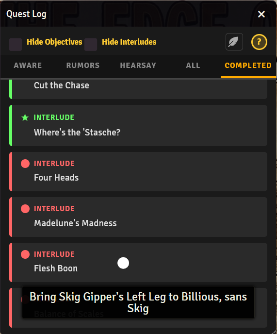
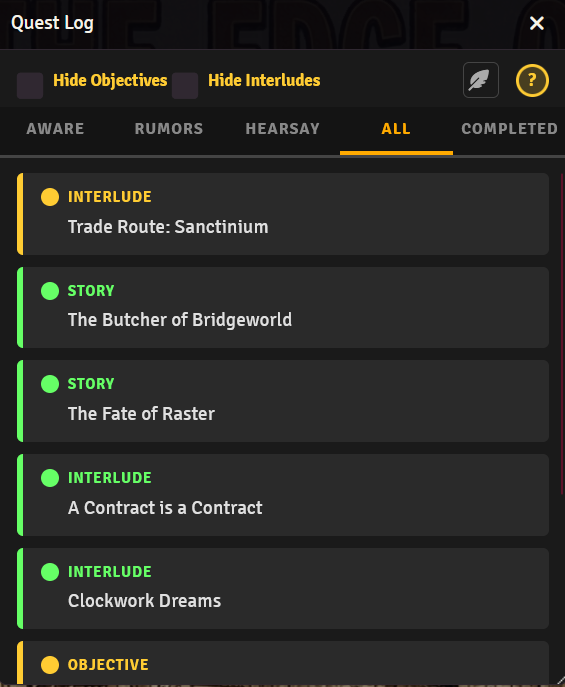
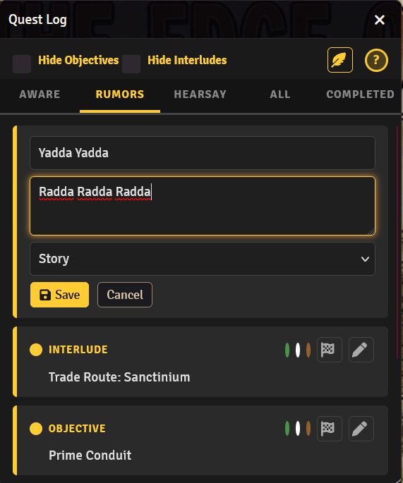

# Victory Quest Tracker

Your players have a quest log now. It lives in a button above the player list, it says Quest Log, and it opens the same window for everyone at the table. The GM's copy has a quill in the corner. That's the whole trick.

# What is Victory Quest Tracker?

Victory Quest Tracker is a shared quest log for Foundry VTT. Every quest has a name, a type (Story, Interlude, or Objective), a note players see on hover, and one of five statuses: Aware, Rumors, Hearsay, Completed, and Failed. The first three get a tab each. Completed and Failed share one, because a failed quest is still a finished quest. It just finished badly.

It started life as a 36 KB script glued to a book item in my PF1e game. Every player carried their own copy of the code inside their inventory, and every fix meant thirteen copies. Why a module? Because I got tired of counting to thirteen.

## Install

Paste this into Foundry's Install Module manifest field:

https://github.com/DatJavaClass/VictoryQuestTracker/releases/latest/download/module.json

Enable the module, done. Players see the button as soon as they qualify (see Options).

## For the GM

Open the Quest Log and click the quill. Every card grows three colored dots, a flag, and a pen. The dots move a quest between Aware, Rumors, and Hearsay in one click. The pen opens the name, note, and type right there in the card. Enter saves, Escape cancels. Add Quest sits at the top of whatever tab you are on and makes a quest at that tab's status, so build a rumor on the Rumors tab and it lands as a rumor.

The flag is the one place I slow you down. Completed and Failed share a tab, and a misclick there would tell the table they lost when they won. So the flag asks first: Completed, Failed, or Cancel. Delete asks the same way.

Every save reaches every connected client the moment it lands. No refresh button, no polling.

## Options

| Setting | Scope | Default | What it does |
| --- | --- | --- | --- |
| Require an item to view | World | On | Players only get the button when their character carries the named item |
| Required item name | World | Pocket Guide to Threshold | Exact item name checked on the assigned character |
| Open on login | Client | On | Opens the log when a player joins, never for GMs |
| Show or hide the Quest Log | Keybinding | Unbound | Set it under Configure Controls |

## Import

Kept quests in a journal the old way, one `Color/Type/Name/Note/` per line? `importJournal(uuid, pageName)` on the API reads a page and pulls them in once. Red becomes Hearsay, a `>>` prefix becomes Completed, and `[Failed]` in the name becomes Failed. Names already in the log are skipped, so running it twice is safe. The button for it is parked in the code; I needed it exactly once.

## API

`game.modules.get("victory-quest-tracker").api` exposes `open()`, `close()`, `toggle()`, `quests()`, `add(quest)`, `set(id, patch)`, `remove(id)`, and `importJournal(uuid, pageName)`. Quest data is one world setting, an array of `{ id, name, note, type, status, created }`.

Built and Vibed with AI.
